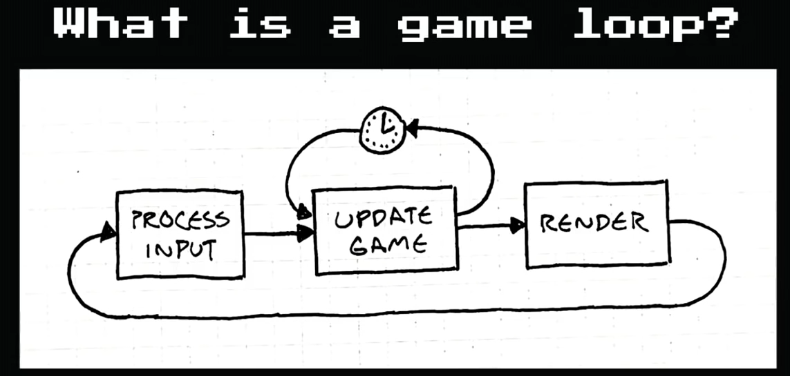
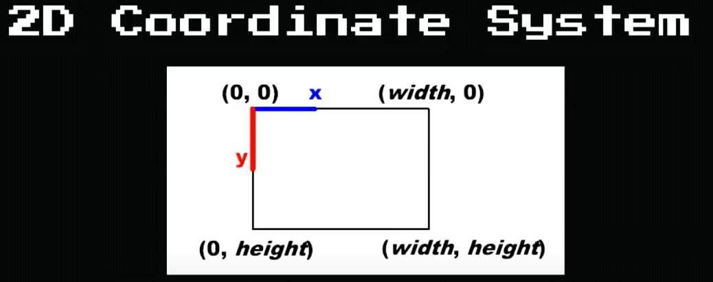

# CS50
CS50's Intro to Game Development from @freeCodeCamp
https://youtube.com/playlist?list=PLWKjhJtqVAbluXJKKbCIb4xd7fcRkpzoz

## I. Pong (with Lua)

### Contents
1. Introduction
2. Lecture Topics

3. What is Lua?

  > - Invented in 19993 in Brazil
  > - Flexible, lightweight scripting language focused around "tables" (similar to Python dictionary or Java object)
  > - Intended for embedded use in larger applications
  > - Very popular in the video game industry
  > - Similarities with JavaScript and some with Python
  > - Data-drive design, excellent for storing data as well as code
  
4. LÖVE2D

  > - Fast 2D game development framework written in C++
  > - Uses Lua as its criptiong language
  > - Contais modules for graphics, keyboard input, mathm audio, windowing, physics and more
  > - Free and portable to major desktrops and mobile OS
  > - Great for prototyping

5. Game Loops

6. 2D Coordinate System

  > - System where objects have an x and a Y coordinete (x, Y)
  > - (0, 0) would be the top-left of our system
  > - Positive directions moving down and to the right
  > - Negative values moving up and to the left
 
 

7. Lecture Scope

  > - Draw shapes to the screen
  > - Control 2D position of paddles based on input
  > - Collision detection between paddles and ball
  > - Collision detection between ball and map boundaries
  > - Sound effects
  > - Scorekeeping

9. The Day-0 Update

  > - Important functions:
  >   - *a. love.load()*    : initialize game state
  >   - *b. love.update(dt)*: called each frame by LÖVE. dt will be the elapsed time in seconds since the last frame
  >   - *c. love.draw()*    : called each frame by LÖVE after update for drawing things to the screen once they've changed
  >   - *d. love.graphics.printf(text, x, y [widht], [align])*: versitile print function that can align text left, right or center
  >   - *e. love.window.setMode(width, height, params)*: used to initialize the window´s dimensions and set to parameters (vsync, full screen, resizable, etc)
  
10. The Low-Res Update
11. Texture Filtering
12. The Rectangle Update
13. The Paddle Update
14. The Ball Update
15. The Class Update
16. The FPS Update
17. The Collision Update
18. AABB Collision Detection
19. The Score Update
20. State Machine
21. The Victory Update
22. The Audio Update
23. bfxr
24. The Resize Update
